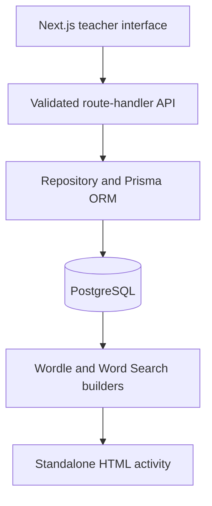

# Phoneme Activity Builder

An accessible full-stack application for creating, storing and exporting phoneme-based Wordle and Word Search activities for Speech Pathology teaching and learning.

Assessment 3 extends the existing Next.js, Prisma and PostgreSQL project with an operational dashboard, persistent generation history, anonymous page-time metrics, labelled simulated input, CSV reporting, alerts and automated test evidence. Generated activities remain standalone HTML files that work offline.

The original frontend and Assessment 2 backend are retained. The project history begins with the existing create-next-app scaffold; this assessment extends that project rather than creating a second application.

## Author

**Anisa Ahmovic**

Student number: **22318777**

Repository: <https://github.com/AnisaAhmovic/phoneme-activity-builder>

## Assessment 3 additions

- `/dashboard`: filter usage by 7 days, 30 days or all time, and by live, simulated or load-test source. Inventory counts show the current database; period filters apply to generation and page-visit records.
- `POST /api/generations`: validates the activity and selected database words, generates HTML on the server, persists the outcome and immutable output snapshot, then returns the download. A unique request ID prevents duplicate counts on retries.
- `/activities/:id`: retrieve a previously generated HTML output, even after its original word list changes or is deleted.
- `POST /api/page-visits`: validated, anonymous cumulative foreground time. The server keeps the highest value received for each visit. No student names, IP addresses or learner results are collected by this feature.
- `GET /api/reports` and `/api/reports/export`: database aggregates and formula-safe CSV. Exports are limited to 10,000 records and reject larger selections rather than silently truncating them.
- Alerts show failed attempts, success rates below 90% (after at least five attempts), empty word lists and unavailable monitoring.

A **saved configuration** is a reusable set of settings. A **successful generation** is a server-generated, persisted HTML output. Preview refreshes are not generation events. Average time is visible-tab duration per builder-site visit, capped at 30 minutes. Closed browsers or network failures can undercount this measure. Offline learner interaction is not monitored.

### Run and validate Assessment 3

```bash
docker compose up --build
```

Open <http://localhost:3000/dashboard>. Compose applies all migrations and seeds the corpus, sample configurations and labelled simulation records. The simulation contains 28 attempts (24 successful and 4 failed) and 12 visits averaging 57.5 seconds. These are synthetic examples, not measured test results.

For local PostgreSQL development:

```bash
cp .env.example .env
npm ci
npm run db:deploy
npm run db:seed
npm run db:simulate
npm run build
npm start
```

In another terminal, run:

```bash
npm run check
npm run test:api
npx playwright install chromium
npm run test:e2e
npm run test:accessibility
npm run test:load
```

`test:load` requires Apache JMeter 5.6.3 and Java. Set `JMETER_BIN` if it is not on PATH. Use a disposable local test database and start the application with `ALLOW_TEST_TRAFFIC=1` to label the tests' `x-traffic-source: LOAD_TEST` requests. This flag is off by default and should remain off for ordinary classroom use. The unauthenticated app is intended for local assessment use; public multi-user deployment needs access control and a retention policy.

Default JMeter stages are 1, 10, 25, 50 and 100 concurrent users, five workflows per user and a five-second ramp. A synchronising timer releases every user together on the first request, and the runner verifies observed peak active threads. Set `LOAD_LEVELS` and `LOAD_LOOPS` to change the plan. These are equivalent staged levels allowed by the brief, not a claim to have tested 10,000 users. Each workflow reads the builder, retrieves stored words, creates a configuration, generates and views an output, reads reporting and deletes its temporary configuration. Load-test generation records are retained for reporting.

GitHub Actions runs the quality checks, actual PostgreSQL 17 migrations, Playwright, Lighthouse, JMeter, a fresh-process persistence check and a Docker build. It uploads raw evidence as `assessment3-evidence`. A workflow definition is not a passing test result; consult the run and its artefacts.

Evidence is written under `evidence/`, excluded from git. `npm run demo:failure` intentionally submits invalid generation data to demonstrate the failed-attempt alert. It does not alter word lists. The video script and traceability notes are supplied in `docs/`.

## Retained Assessment 2 coverage

| Criterion | Implementation |
| --- | --- |
| Data schema and phoneme model | Normalised `WordList`, `Word`, `ActivityConfiguration` and `ActivityConfigurationWord` models; PostgreSQL arrays preserve multi-character phonemes such as `tʃ` as one sequence item; foreign keys, indexes, uniqueness rules and database constraints protect the data. |
| CRUD APIs and health | Next.js route handlers provide create, retrieve, update and delete operations for word lists, words and activity configurations. `/health` verifies the live database connection and returns HTTP 200 only when healthy. |
| Docker | A multi-stage `Dockerfile` creates a non-root production image. `compose.yaml` starts PostgreSQL, applies migrations, seeds demonstration data, then starts and health-checks the application. |
| Integration and generation | The Teacher Library writes teacher-entered data through the API. Both builders retrieve that data, save multiple configurations and embed the selected database records and output settings into standalone HTML. |
| Code quality and GitHub | TypeScript, Zod validation, a repository layer, structured API errors, Prisma migrations, unit tests, an end-to-end API smoke test and GitHub Actions provide a maintainable workflow. |

The Assessment 1 feedback is also addressed by adding a System theme and replacing the fixed-dataset-only workflow with direct teacher entry of written words and phoneme sequences.

## Architecture



The interface and API are kept in one Next.js project. The browser never connects to PostgreSQL directly: client components call route handlers, route handlers validate requests, and the server-side repository is the only layer that uses Prisma.

## Features

### Teacher Library

Teachers can:

- create, retrieve, rename and delete word lists
- add words using their own spellings and three-to-five-item phoneme sequences
- store a multi-character symbol such as `tʃ`, `dʒ` or `eɪ` as one phoneme
- update spelling, phonemes, hint and difficulty metadata
- delete words that are not in use by a saved configuration
- see API validation and database conflict messages in the interface

### Phoneme Wordle

The database-backed builder supports:

- three, four or five phoneme targets
- a teacher-selected stored word and list
- one to ten attempts
- optional phoneme hints and answer key
- a configurable output filename
- create, retrieve, update, load and delete operations for saved configurations
- an accessible live preview and on-screen phoneme keyboard
- standalone HTML with exact, present and absent scoring plus restart controls

### Phoneme Word Search

The database-backed builder supports:

- teacher-selected words with three, four or five phonemes
- six-to-sixteen-row and column grids
- horizontal, vertical and diagonal placement in both directions
- optional phoneme hints and answer-reveal control
- a configurable output filename
- create, retrieve, update, load and delete operations for saved configurations
- mouse dragging, endpoint clicking and keyboard selection
- standalone HTML with found-word tracking and persistent feedback

### Display and accessibility

- Light, Dark and System colour themes
- Standard and Wide layouts
- cookie-persisted preferences applied during server rendering
- responsive desktop, tablet and compact layouts
- semantic headings, fieldsets, table headings and labelled controls
- visible hover and keyboard focus states
- ARIA grids and live status or error feedback
- keyboard-operable generated Word Search activities
- an embedded guide with a written transcript

## Application routes

| Route | Purpose |
| --- | --- |
| `/` | Home page and entry points |
| `/about` | Project scope, student details and original interface guide |
| `/library` | Teacher CRUD interface for stored lists and words |
| `/wordle` | Database-backed Wordle builder and saved configurations |
| `/word-search` | Database-backed Word Search builder and saved configurations |
| `/settings` | Theme and layout preferences |
| `/health` | Application and database health check |

## Data model

| Model | Important fields and relationships |
| --- | --- |
| `WordList` | Unique name, optional description, timestamps, many words and many saved configurations |
| `Word` | Written spelling, `String[]` phoneme sequence, optional hint, difficulty, parent list and timestamps |
| `ActivityConfiguration` | Activity type, difficulty, phoneme length, grid dimensions, attempt limit, hint and answer settings, filename, notes and parent list |
| `ActivityConfigurationWord` | Ordered many-to-many selection between configurations and words, including the Wordle target flag |

The database migration enforces three-to-five phoneme sequences, valid activity phoneme counts, one-to-ten attempts and activity-appropriate grid dimensions. The repository additionally verifies that every selected word belongs to the chosen list and matches the configuration's phoneme count.

## API

Successful JSON responses use `{ "data": ... }`. Errors use a consistent `error` object with a stable code, readable message and optional field details.

| Method and route | Operation |
| --- | --- |
| `GET /api/word-lists` | Retrieve all lists with their words |
| `POST /api/word-lists` | Create a list, optionally with initial words |
| `GET /api/word-lists/:id` | Retrieve one list |
| `PATCH /api/word-lists/:id` | Update a list |
| `DELETE /api/word-lists/:id` | Delete a list and its dependent records |
| `GET /api/words?wordListId=:id` | Retrieve words, optionally filtered by list |
| `POST /api/words` | Create a word |
| `GET /api/words/:id` | Retrieve a word |
| `PATCH /api/words/:id` | Update a word |
| `DELETE /api/words/:id` | Delete an unused word |
| `GET /api/activity-configurations?type=WORDLE` | Retrieve configurations, optionally filtered by type |
| `POST /api/activity-configurations` | Create a configuration |
| `GET /api/activity-configurations/:id` | Retrieve a configuration with ordered words |
| `PATCH /api/activity-configurations/:id` | Partially update a configuration |
| `DELETE /api/activity-configurations/:id` | Delete a configuration |

Example validation error:

```json
{
  "error": {
    "code": "VALIDATION_ERROR",
    "message": "Check the submitted fields and try again.",
    "details": [
      {
        "field": "phonemes",
        "message": "Enter at least three phonemes."
      }
    ]
  }
}
```

## Run the complete system with Docker

### Prerequisites

- Docker Desktop or Docker Engine
- Docker Compose v2

### Start

```bash
docker compose up --build
```

Compose waits for PostgreSQL, runs every committed migration, seeds 90 demonstration words and two saved activities, and then exposes the application at <http://localhost:3000>.

Check the required health endpoint:

```bash
curl --fail http://localhost:3000/health
```

Expected response structure:

```json
{
  "status": "ok",
  "database": "connected",
  "timestamp": "2026-09-14T00:00:00.000Z"
}
```

Stop the containers while retaining the database volume:

```bash
docker compose down
```

For a deliberate clean reset, `docker compose down --volumes` also deletes the local PostgreSQL volume and all locally entered content.

## Run locally without Docker

### Prerequisites

- Node.js 22 or later
- npm
- PostgreSQL

Copy the example environment file and replace the credentials if required:

```bash
cp .env.example .env
npm ci
npm run db:deploy
npm run db:seed
npm run dev
```

Open <http://localhost:3000>.

The committed `.env.example` contains only local example values. Real credentials are excluded by `.gitignore`.

## Database commands

| Command | Purpose |
| --- | --- |
| `npm run db:generate` | Regenerate the typed Prisma client |
| `npm run db:migrate` | Create or apply a development migration |
| `npm run db:deploy` | Apply committed migrations without modifying schema history |
| `npm run db:seed` | Idempotently load the demonstration content |
| `npm run db:studio` | Inspect local data in Prisma Studio |

The seed can be run repeatedly. It updates the starter corpus, then recreates only the two named sample configurations. Teacher-created lists and activities are not removed.

## Validation and tests

Run the complete local quality gate:

```bash
npm run check
```

This runs ESLint, TypeScript, eight unit tests and the production build.

With the application and database running, verify HTTP 200 health plus end-to-end list, word and saved-activity CRUD:

```bash
npm run test:api
```

The smoke test uses temporary uniquely named data and removes it when complete. GitHub Actions performs the same database preparation, static checks, unit tests, production build, API smoke test and Docker image build for pull requests.

## Standalone output

The builders generate rather than merely link to an activity page. Each downloaded file contains its own semantic HTML, CSS, JavaScript and serialised activity data. It can be opened from a local `file://` address after the Next.js application has stopped.

The stored settings that affect generated output are:

- activity type and phoneme count
- selected and target words
- Word Search rows and columns
- Wordle maximum attempts
- phoneme hints on or off
- answer key or answer reveal on or off
- requested output filename

## Project structure

```text
phoneme-activity-builder/
├── .github/workflows/       # Automated checks
├── prisma/
│   ├── migrations/          # Versioned PostgreSQL schema
│   ├── schema.prisma        # ORM data model
│   └── seed.ts              # Demonstration content
├── public/                  # Static guide video
├── scripts/api-smoke.mjs    # Live health and CRUD verification
├── src/
│   ├── app/
│   │   ├── api/             # Backend route handlers
│   │   ├── health/          # Database-aware health endpoint
│   │   ├── library/         # Teacher content-management page
│   │   ├── wordle/          # Wordle page
│   │   └── word-search/     # Word Search page
│   ├── components/          # Reusable client interface components
│   ├── data/                # Demonstration phoneme corpus and hints
│   ├── hooks/               # Shared data-loading hook
│   ├── lib/                 # API client, validation and mappings
│   ├── server/              # Prisma client, repository and HTTP errors
│   ├── types/               # Shared TypeScript contracts
│   └── utils/               # Puzzle and standalone HTML generation
├── tests/                   # Unit tests
├── compose.yaml
├── Dockerfile
└── README.md
```

## References (APA 7)

Docker, Inc. (n.d.-a). *Compose file reference*. Retrieved September 09, 2026, from https://docs.docker.com/reference/compose-file/

Docker, Inc. (n.d.-b). *Multi-stage builds*. Retrieved September 09, 2026, from https://docs.docker.com/build/building/multi-stage/

International Phonetic Association. (1999). *Handbook of the International Phonetic Association: A guide to the use of the International Phonetic Alphabet*. Cambridge University Press. https://doi.org/10.1017/9780511807954

PostgreSQL Global Development Group. (n.d.). *Arrays*. Retrieved September 09, 2026, from https://www.postgresql.org/docs/current/arrays.html

Prisma Data, Inc. (n.d.-a). *Prisma schema overview*. Retrieved September 11, 2026, from https://www.prisma.io/docs/orm/prisma-schema/overview

Prisma Data, Inc. (n.d.-b). *Prisma Migrate*. Retrieved September 11, 2026, from https://www.prisma.io/docs/orm/prisma-migrate

Vercel. (n.d.). *Route handlers*. Next.js. Retrieved September 11, 2026, from https://nextjs.org/docs/app/getting-started/route-handlers

World Wide Web Consortium. (2023, October 5). *Web Content Accessibility Guidelines (WCAG) 2.2*. https://www.w3.org/TR/WCAG22/

## Repository workflow

Assessment 2 work is developed on a feature branch and reviewed through a pull request. The stable `main` branch is not changed directly. Generated clients, dependencies, builds and real environment files are excluded from version control.
